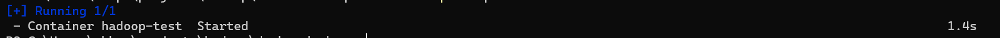

# Installing Hadoop, DSFS, DFS, with Docker.

What is Docker?

Docker is an open platform for developing, shipping, and running applications. Docker enables you to separate your applications from your infrastructure so you can deliver software quickly. With Docker, you can manage your infrastructure in the same ways you manage your applications. By taking advantage of Docker's methodologies for shipping, testing, and deploying code, you can significantly reduce the delay between writing code and running it in production.

__Don't stress out__, Docker just runs a VM on your Computer


## Step 1 - Install Docker on your machine

### For Windows:
 . Go to this link to download Docker desktop [Click Here](https://desktop.docker.com/win/main/amd64/Docker%20Desktop%20Installer.exe?_gl=1*khq2mc*_ga*NTk1Mjc3NDA1LjE2OTU2NzkyNDk.*_ga_XJWPQMJYHQ*MTY5NTY3OTI0OC4xLjEuMTY5NTY4MDQzOC42MC4wLjA.)

. Install the docker downloaded above make sure to follow the process accurately.

### For MAC:
. Follow the steps based on the chip you are having: [Click Here](https://docs.docker.com/desktop/install/mac-install/)

## Step 2 - Clone / Download following repository
> git clone https://github.com/akkpuvvada/docker-hadoop.git

or

> download from here [akkpuvvada](https://github.com/akkpuvvada/docker-hadoop)

## Step 3 - Install the VS code editor
> Download and Install [VSCode](https://code.visualstudio.com/)

## Step 4 - Make sure to change the line ending of the file
Open VS code and change the docker-entrypoint.sh extension on the bottom Find below image for reference


### Step for Root Users/MAC - Update the permissions for docker-entrypoint.sh file
Go to the folder containing the files for docker and run this command
> chmod 777 ./docker-entrypoint.sh
## Step 5 - Open the CMD at project path and execute following commands
The following command is for running the container everytime.
> docker-compose up -d

It should show following output


## Step 6 - Enter into the linux VM / Container

> docker exec -it hadoop-bigdata /bin/bash

# Examples

> [!Warning]
> Please follow all the steps in same sequence. Also do not miss the file formattings
## Example to run using Mapreduce job using python
. Navigate to examples folder
> cd /app/examples

. Create directory in HDFS DFS
```
hdfs dfs -mkdir /user
hdfs dfs -mkdir /user/hduser
```

. Create input directory and copy files

> [!Warning]
> Make sure the input files EOL sequence is LF and format of the file is UTF-8

```
hdfs dfs -mkdir input
hdfs dfs -put *.txt input
```

. Run the command to check the working of Mapreduce job with python
. We are using hadoop-streaming tool for integrating python
> hadoop jar $HADOOP_HOME/share/hadoop/tools/lib/hadoop-streaming-3.3.3.jar -mapper mapper.py -reducer reducer.py -input /user/hduser/input/*.txt -output /user/hduser/output

## Example to run Mapreduce job using using Java (OPTIONAL)

. Make HDFS directories required to execute MapReduce jobs: [Skip this if you already executed with python above]

```
hdfs dfs -mkdir /user
hdfs dfs -mkdir /user/hduser
```

. Create a input directory
```
hdfs dfs -mkdir input
hdfs dfs -put $HADOOP_HOME/etc/hadoop/*.xml input
```

. Run the Example now and check the output it should print the bytes read from file
> hadoop jar $HADOOP_HOME/share/hadoop/mapreduce/hadoop-mapreduce-examples-3.3.3.jar grep input output ‘dfs[a-z.]+’
